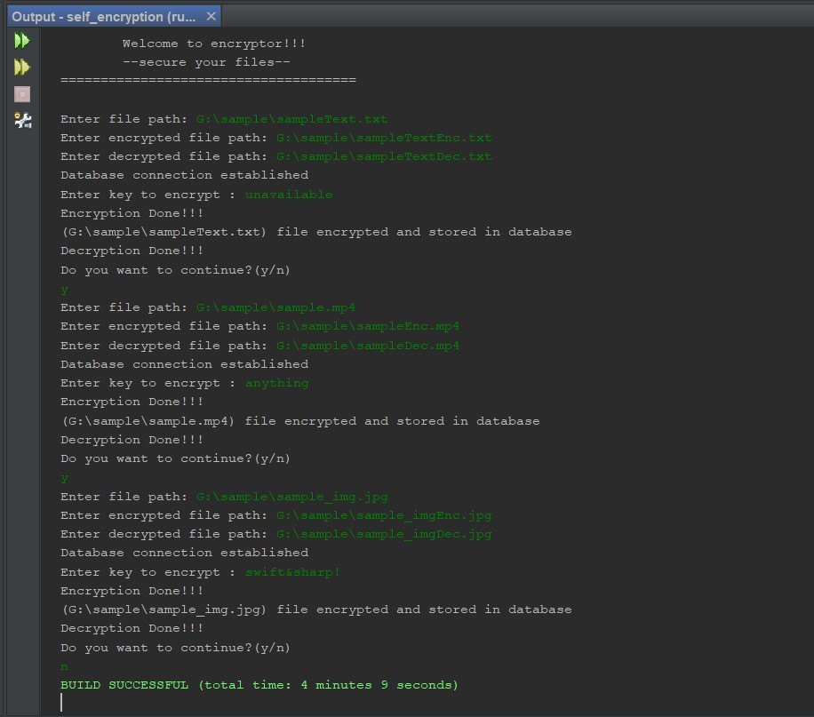
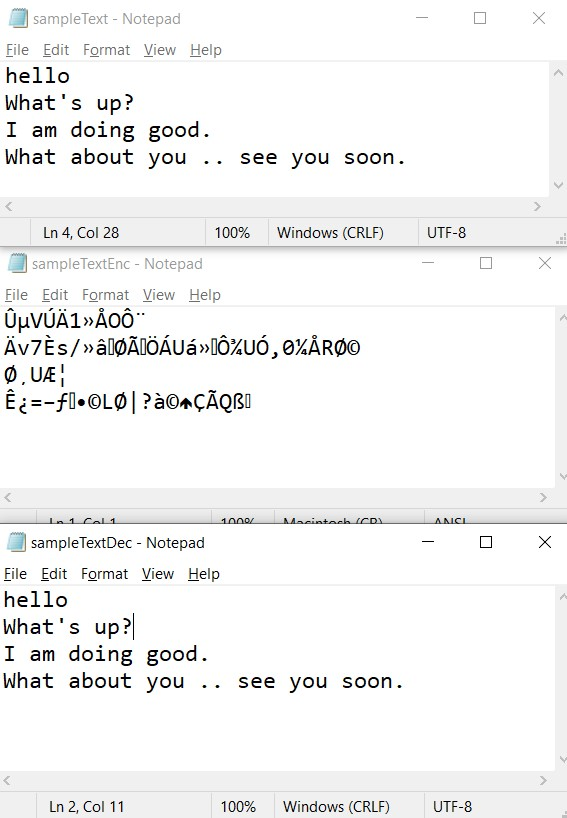
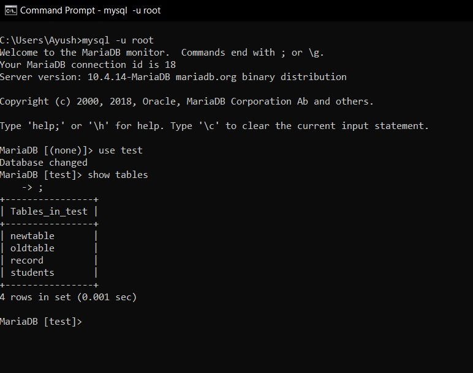
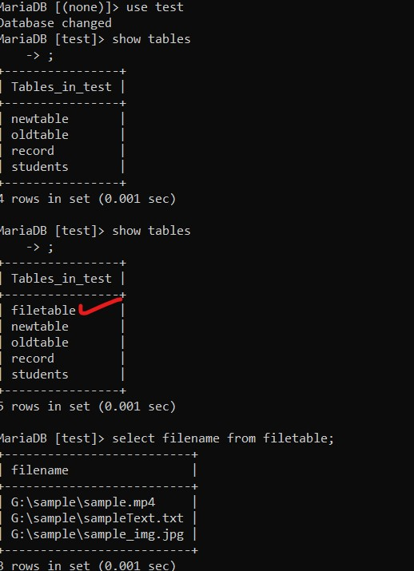

# **Encryptor**

>_The project aims to provides secure storage of data in the database._

 * It uses *“Cryptography using Colors and Armstrong Numbers”* for encryption and decryption of data.
 * The algorithm operates on _Bytes_ and therefore it supports all file formats.
___
 >## Sample Output
 
 1. ### Output console
    
 1. ### Demo Files 

    * *Text File*
        

    * *Image File*
        

 1. ### DB console
    * Before ->
    * After -> 
___
> ## References

