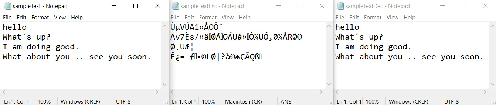

> # **Encryptor**
>_The project aims to provides secure storage of data in the database._

 * It uses *“Cryptography using Colors and Armstrong Numbers”* for encryption and decryption of data.
 * It uses three keys for encryption, which are user provided key, generated numeric key, and color key.
    1. Firstly, a numeric key is generated from the key provided by the user.
        * Then sum of ascii values of characters in key provided by user is obtained .
        * Using the above obtained sum, now we will select a permutation from the array containing all permutation of [ 1, 2, 3, 4]  (as there exists 4 armstrong numbers { 153, 370, 371, 407 } )
        * Using the permutation selected from the array of permutations we will form key by selecting the armstrong numbers from array of armstrong numbers in the order they appear the selected permutation and generate a part 'A' of numeric key.
        * Final numeric key is obtained by appending the sum of ascii values(part 'B') of characters within the key provided by user.
        * Final Numeric Key = part 'A' + part 'B'
    1. Then the data is *byte by byte* xored with numeric key genereated in previous step.
    1. The encrypted data is further encrypted using colors.
        * Each byte of data is split-up into 4-bits each. The most significant 4-bits(higher order bits) are used to obtain row, and the least significant 4-bits(lower order bits) are used to obtain column from the color matrix.
        * The numeric key is again utilised to obtain base values of the Red, Green, and Blue color matrix.(refer the 4th image below **"Obtaining color value from Color Matrix"**)
        * For consecutive data bytes, these three colors are selected in a consecutive manner.
        * Then using row and column value obtained above, we obtain color value at selected color matrix's [ row, col ] using base value, for each data byte and return the value obtained as the final encrypted value.
    1. Thus, we ensure double layer encryption.
 * The Decryption process follows exactly reverse mechanism to obtain back the original data.
 * The algorithm operates on _Bytes_ and therefore it supports all file formats.
___
> ## Representation
1. #### Data Flow
    <image src="./references/dataflow.png" width="500" height="300">
1. #### Encryption 
    <image src="./references/Encryption.png" width="500" height="600"/>
1. #### Decryption 
    <image src="./references/Decryption.png" width="500" height="600"/>
1. #### Obtaining color value from Color Matrix
    <image src="./references/colormatrix.png" width="500" height="300"/>

___
 >## Sample Output
 
 1. #### Output console
       <image src="./outputImages/output.jpg" width="500" height="500"/>
 1. #### Demo Files 

    * ##### **Text File**
        

    * ##### **Image File**
        

 1. #### DB console
    * ##### **Before**
        <image src="./outputImages/db1.jpg" width="500" height="400"/>
    * ##### **After** 
        <image src="./outputImages/db2.jpg" width="500" height="400"/>
___
> ## References
* [IEEE paper](https://ieeexplore.ieee.org/document/5738822)